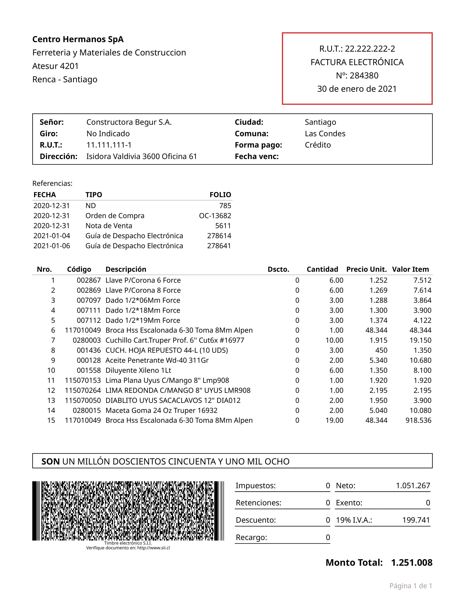

# 🇨🇱 sii_chile_xml_to_pdf

[](https://www.python.org/)
[](LICENSE)

Convierte documentos electrónicos XML del **SII (Servicio de Impuestos Internos, Chile)** a **PDF** de manera rápida y automática.  
Compatible con **facturas, guías de despacho, notas de crédito, notas de débito, boletas y más**.

---

## ✨ Características

- 📄 Conversión **XML → PDF** con plantillas HTML/CSS.
- 📊 Exportación de datos estructurados a **Excel** (resumen de facturas).
- 📂 Procesa **un archivo** o **carpetas completas** de XML.
- 🖋️ Genera timbre **PDF417** en los documentos.
- 🗂️ **Nombrado inteligente de PDFs** usando datos del XML (`fecha_tipo_razonSocial_folio.pdf`).
- ⚡ Instalación como **paquete Python (CLI)** o despliegue como **microservicio Docker**.
- 📦 Nuevo endpoint `render-zip`: permite subir un **ZIP con XMLs** y un **email de destino**. El servicio procesa todos los XML, genera los PDFs y los envía al correo especificado.

---

## 🚀 Instalación como Paquete Python

Clona el repositorio y entra en la carpeta:

```bash
git clone https://github.com/tonicanada/sii_chile_xml_to_pdf.git
cd sii_chile_xml_to_pdf
```

### Dependencias del sistema

WeasyPrint —el motor que rasteriza el PDF— no es Python puro: necesita las
librerías de Cairo y Pango del sistema. Si faltan, `pip install` termina bien y
el fallo aparece luego, al generar el primer PDF. En Debian/Ubuntu:

```bash
sudo apt-get install -y \
  libcairo2 libpango-1.0-0 libpangoft2-1.0-0 libgdk-pixbuf-2.0-0 \
  libffi-dev libxml2 libxslt1.1 libharfbuzz0b libfreetype6 \
  shared-mime-info fonts-dejavu-core
```

En macOS con Homebrew: `brew install cairo pango gdk-pixbuf libffi`.

Si prefieres no instalar nada de esto, usa el despliegue con Docker que está más
abajo: la imagen ya las trae.

_Gracias a [@berttty](https://github.com/berttty) por señalar que faltaban
documentadas._

Crea y activa un entorno virtual:

```bash
python -m venv venv
source venv/bin/activate   # Linux / macOS
venv\Scripts\activate    # Windows
```

Instala en modo editable:

```bash
pip install -e .
```

---

## 🔧 Uso de la CLI

Después de instalar, dispones del comando `sii-xml-pdf`.

### 1) Convertir un XML a PDF
```bash
sii-xml-pdf convert examples/input/T33_factura_ejemplo_1.xml -o examples/output/
```

### 2) Convertir una carpeta completa de XML
```bash
sii-xml-pdf convert-folder examples/input -o examples/output/pdf
```

### 3) Generar un Excel con resumen de facturas
```bash
sii-xml-pdf extract-excel examples/input -o examples/output/listado.xlsx
```

👉 Los PDFs se generan en `output/pdf/` y el Excel en `output/`.

---

## 🐳 Uso como Microservicio con Docker

Este proyecto también puede correr como **microservicio REST** (FastAPI + Uvicorn).

### 1. Configuración de variables de entorno

Copia el archivo de ejemplo y ajusta tus valores:

```bash
cp .env.example .env
```

`.env.example`:

```env
API_TOKEN=supersecreto
PORT=8080
HOST_PORT=9000

# Configuración email
SMTP_USER=usuario@dominio.com
SMTP_PASS=contraseña_de_aplicacion
SMTP_FROM=usuario@dominio.com
SMTP_HOST=smtp.dominio.com
SMTP_PORT=587

# Usas STARTTLS (587)
MAIL_STARTTLS=True
MAIL_SSL_TLS=False
```

### 2. Levantar con Docker Compose

El repositorio incluye dos configuraciones:

- `docker-compose.dev.yml` → entorno de desarrollo (hot-reload con Uvicorn, volumen montado).  
- `docker-compose.yml` → entorno de producción (Gunicorn + UvicornWorker, healthchecks, logs, etc.).  

Ejemplo desarrollo:

```bash
docker compose -f docker-compose.dev.yml up --build -d
```

Ejemplo producción:

```bash
docker compose -f docker-compose.yml up -d
```

El servicio quedará disponible en:

```
http://localhost:9000
```

### 3. Endpoints disponibles

- **Salud del servicio**
  ```bash
  curl http://localhost:9000/healthz
  ```
  Respuesta:
  ```json
  {"status": "ok"}
  ```

- **Conversión XML → PDF**
  ```bash
  curl -X POST "http://localhost:9000/render"        -H "Authorization: Bearer supersecreto"        -F "file=@examples/input/T33_factura_ejemplo_1.xml"        -o salida.pdf
  ```

- **Conversión ZIP de XML y envío por correo**
  ```bash
  curl -X POST "http://localhost:9000/render-zip"        -H "Authorization: Bearer supersecreto"        -F "email=usuario@correo.com"        -F "file=@examples/input/facturas.zip"
  ```
  El servicio procesa el ZIP, genera PDFs y los envía al email indicado.

### 4. Autenticación por Token

El microservicio requiere un token en cada petición:

- Se define en `.env` (`API_TOKEN`).  
- Se envía en las cabeceras HTTP:
  ```
  Authorization: Bearer <token>
  ```
- Para generar un token seguro:
  ```bash
  openssl rand -hex 32
  ```
- Si necesitas rotarlo: generas uno nuevo, actualizas `.env` y reinicias el servicio (`docker compose up -d`).

---

## 📂 Estructura del proyecto

```
sii_chile_xml_to_pdf/
├── examples/         # XML y resultados de ejemplo
│   ├── input/        # Archivos XML de entrada
│   └── output/       # PDFs y Excel generados
├── src/
│   ├── sii_xml_pdf/  # Código fuente (parser, renderer, cli)
│   └── service/      # Microservicio FastAPI
├── Dockerfile
├── docker-compose.yml
├── docker-compose.dev.yml
├── .env.example
├── README.md
└── pyproject.toml
```

---

## 🔮 Roadmap / TODO

- [ ] Parsear correctamente los **descuentos por ítem**.
- [ ] Extender soporte a otros tipos de documentos.
- [ ] Agregar soporte de colas para cargas masivas.

---

## 💡 Ejemplos

### XML de entrada
```xml
<Documento>
  <Encabezado>
    <IdDoc>
      <TipoDTE>33</TipoDTE>
      <Folio>1001</Folio>
    </IdDoc>
    ...
</Documento>
```

### PDF generado

Por ejemplo, a partir de un XML de factura con:

- Fecha: `2025-06-25`
- Razón social: `Cliente Demo Spa`
- Folio: `1001`

se genera un PDF con nombre:

```
20250625 FC Cliente Demo Spa 1001.pdf
```



---

## ⭐ Contribuye

Este proyecto ya alcanzó más de **15 estrellas en versiones anteriores** 🎉.  
¡Si te resulta útil, no olvides dejar tu ⭐ en GitHub!  

Las contribuciones, PRs y sugerencias son siempre bienvenidas.

---

## 📜 Licencia

Distribuido bajo licencia MIT.