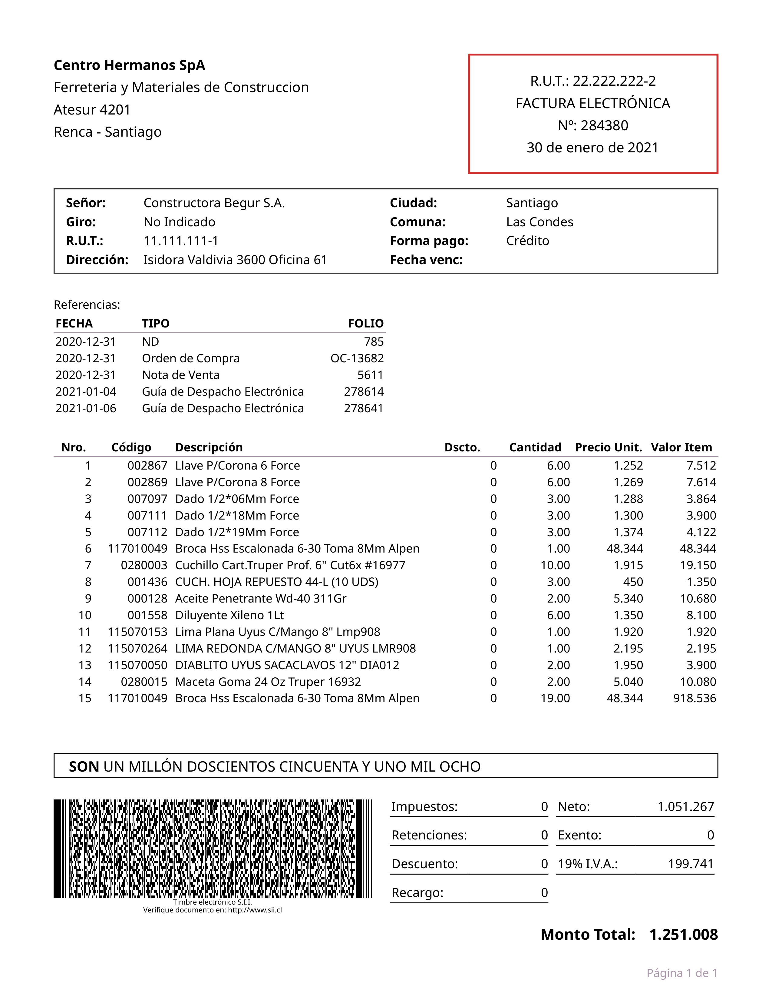

# 🇨🇱 sii_chile_xml_to_pdf

[](https://www.python.org/)
[](LICENSE)

Convierte documentos electrónicos XML del **SII (Servicio de Impuestos Internos, Chile)** a **PDF** de manera rápida y automática.  
Compatible con **facturas, guías de despacho, notas de crédito, notas de débito, boletas y más**.

---

## ✨ Características

- 📄 Conversión **XML → PDF** con plantillas HTML/CSS.
- 📊 Exportación de datos estructurados a **Excel** (resumen de facturas).
- 📂 Procesa **un archivo** o **carpetas completas** de XML.
- 🖋️ Genera timbre **PDF417** en los documentos.
- 🗂️ **Nombrado inteligente de PDFs** usando datos del XML (`fecha_tipo_razonSocial_folio.pdf`).
- ⚡ Instalación sencilla como **paquete Python** con CLI integrada.

---

## 🚀 Instalación

Clona el repositorio y entra en la carpeta:

```bash
git clone https://github.com/tuusuario/sii_chile_xml_to_pdf.git
cd sii_chile_xml_to_pdf
```

Crea y activa un entorno virtual:

```bash
python -m venv venv
source venv/bin/activate   # Linux / macOS
venv\Scripts\activate      # Windows
```

Instala en modo editable:

```bash
pip install -e .
```

---

## 🔧 Uso de la CLI

Después de instalar, dispones del comando `sii-xml-pdf`.

### 1) Convertir un XML a PDF
```bash
sii-xml-pdf convert examples/input/T33_factura_ejemplo_1.xml -o examples/output/
```

### 2) Convertir una carpeta completa de XML
```bash
sii-xml-pdf convert-folder examples/input -o examples/output/pdf
```

### 3) Generar un Excel con resumen de facturas
```bash
sii-xml-pdf extract-excel examples/input -o examples/output/listado.xlsx
```

👉 Los PDFs se generan en `output/pdf/` y el Excel en `output/`.

---

## 📂 Estructura del proyecto

```
sii_chile_xml_to_pdf/
├── examples/         # XML y resultados de ejemplo
│   ├── input/        # Archivos XML de entrada
│   └── output/       # PDFs y Excel generados
├── src/sii_xml_pdf/  # Código fuente (parser, renderer, cli)
├── README.md
├── pyproject.toml
└── requirements.txt  # (opcional, solo para entornos congelados)
```

---

## 🔮 Roadmap / TODO

- [ ] Parsear correctamente los **descuentos por ítem**.
- [ ] Extender soporte a otros tipos de documentos.

---

## 💡 Ejemplos

### XML de entrada
```xml
<Documento>
  <Encabezado>
    <IdDoc>
      <TipoDTE>33</TipoDTE>
      <Folio>1001</Folio>
    </IdDoc>
    ...
</Documento>
```

### PDF generado

Por ejemplo, a partir de un XML de factura con:

- Fecha: `2025-06-25`
- Razón social: `Cliente Demo Spa`
- Folio: `1001`

se genera un PDF con nombre:

```
20250625 FC Cliente Demo Spa 1001.pdf
```



---

## ⭐ Contribuye

Este proyecto ya alcanzó más de **15 estrellas en versiones anteriores** 🎉.  
¡Si te resulta útil, no olvides dejar tu ⭐ en GitHub!  

Las contribuciones, PRs y sugerencias son siempre bienvenidas.

---

## 📜 Licencia

Distribuido bajo licencia MIT.  